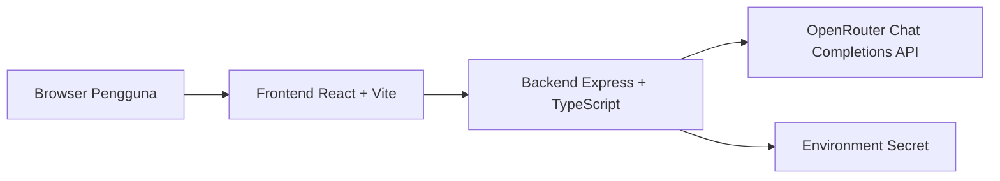
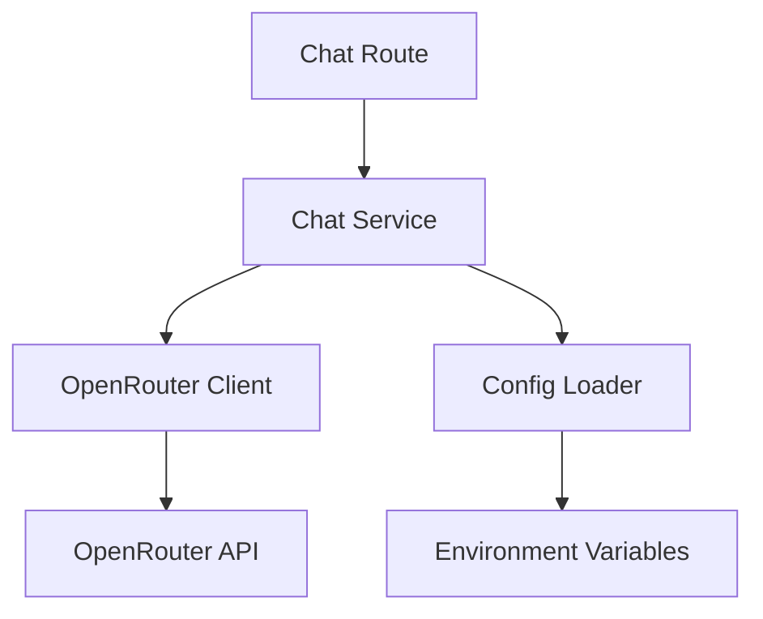
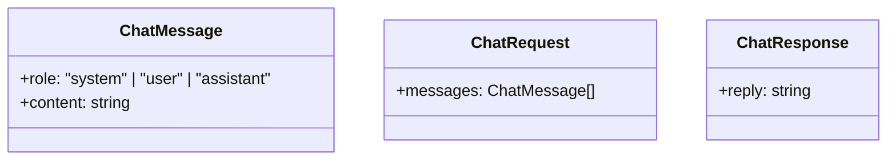

## 1. Desain Arsitektur


## 2. Deskripsi Teknologi
- Frontend: React 18 + TypeScript + Vite + Tailwind CSS + Zustand
- Inisialisasi: `vite-init` dengan template `react-express-ts`
- Backend: Express 4 + TypeScript
- Database: Tidak ada pada MVP, data percakapan disimpan sementara di state frontend
- External service: OpenRouter API untuk model chat
- Ikon: `lucide-react`

## 3. Definisi Rute
| Rute | Tujuan |
|------|--------|
| `/` | Halaman utama chat `pesut.ai` |
| `/api/chat` | Endpoint POST untuk mengirim percakapan ke OpenRouter |
| `/api/health` | Endpoint GET sederhana untuk mengecek server aktif |

## 4. Definisi API
### 4.1 Tipe Data
```ts
type ChatRole = 'system' | 'user' | 'assistant'

interface ChatMessage {
  role: ChatRole
  content: string
}

interface ChatRequest {
  messages: ChatMessage[]
}

interface ChatResponse {
  reply: string
}

interface ErrorResponse {
  error: string
}
```

### 4.2 Kontrak Endpoint
#### `POST /api/chat`
Request body:
```json
{
  "messages": [
    { "role": "user", "content": "Halo, bantu aku atur jadwal hari ini." }
  ]
}
```

Success response:
```json
{
  "reply": "Tentu, saya bantu atur jadwalmu hari ini."
}
```

Error response:
```json
{
  "error": "Gagal menghubungi layanan AI"
}
```

#### `GET /api/health`
Success response:
```json
{
  "status": "ok"
}
```

## 5. Diagram Arsitektur Server


## 6. Model Data
### 6.1 Definisi Model
MVP tidak memakai database. Struktur data utama berada di memori frontend dan payload request:



## 7. Keamanan Secret
- `OPENROUTER_API_KEY` hanya dibaca oleh backend Express
- Frontend tidak pernah menerima API key
- File `.env` hanya untuk lokal dan harus diabaikan Git
- Pada deploy, secret dimasukkan lewat dashboard environment variables platform
- API key yang pernah dibagikan di chat tidak dipakai; pengguna perlu membuat key baru sebelum produksi

## 8. Strategi Deploy Gratis
- Target utama: `Render`
- Alasan:
  - mendukung Node full-stack sederhana
  - pengaturan environment secret mudah
  - deploy dari GitHub tanpa token deploy tambahan
  - cukup cocok untuk MVP chat assistant

## 9. Catatan Implementasi
- Gunakan system prompt ringan agar AI terasa sebagai personal assistant yang ramah dan jelas
- Batasi panjang history yang dikirim agar biaya dan latensi tetap rendah
- Tambahkan fallback error message yang mudah dipahami pengguna
- Siapkan struktur komponen modular agar fitur baru mudah ditambahkan
