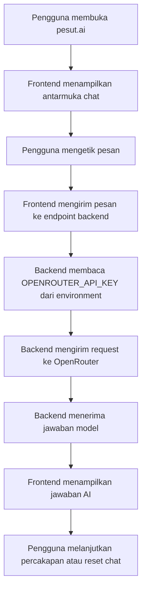

## 1. Gambaran Produk
`pesut.ai` adalah web chat AI yang berperan sebagai personal assistant untuk percakapan harian, tanya jawab, dan bantuan umum berbasis OpenRouter.
- Produk ini menargetkan MVP yang cepat jalan: pengguna membuka website, mengetik pesan, lalu menerima balasan AI secara nyaman dan natural.
- Nilai awal produk adalah memberi pondasi yang siap dikembangkan ke fitur lanjutan seperti memory, persona, pencarian web, dan mode tugas khusus.

## 2. Fitur Inti

### 2.1 Peran Pengguna
| Peran | Cara Akses | Izin Inti |
|------|------------|-----------|
| Pengguna umum | Langsung membuka website | Mengirim pesan, melihat jawaban AI, menghapus riwayat lokal |

### 2.2 Modul Fitur
1. **Halaman utama chat**: identitas merek `pesut.ai`, panel percakapan, area input pesan, status respons AI.
2. **Lapisan konfigurasi backend ringan**: endpoint aman untuk meneruskan request ke OpenRouter tanpa mengekspos API key ke browser.
3. **Pengelolaan sesi lokal**: riwayat percakapan sementara selama sesi aktif dan tombol reset percakapan.

### 2.3 Detail Halaman
| Nama Halaman | Nama Modul | Deskripsi fitur |
|-------------|------------|-----------------|
| Halaman chat | Hero ringkas | Menampilkan nama `pesut.ai`, tagline personal assistant, dan arahan penggunaan singkat |
| Halaman chat | Panel percakapan | Menampilkan pesan pengguna dan AI dengan tampilan yang mudah dibaca dan mendukung percakapan bertahap |
| Halaman chat | Input composer | Kolom teks, tombol kirim, indikator loading, dan dukungan tombol Enter |
| Halaman chat | Tombol reset | Menghapus riwayat sesi agar percakapan bisa dimulai ulang |
| Halaman chat | Status koneksi | Menampilkan state seperti siap, sedang membalas, atau gagal menghubungi AI |
| Backend ringan | Proxy AI | Menerima pesan dari frontend, menambah system prompt dasar, lalu meneruskan ke OpenRouter |
| Backend ringan | Validasi secret | Membaca `OPENROUTER_API_KEY` hanya dari environment server atau secret deploy |

## 3. Proses Inti
Pengguna membuka website `pesut.ai`, melihat antarmuka chat, mengetik pesan, lalu frontend mengirim riwayat percakapan ke backend. Backend memanggil OpenRouter menggunakan API key dari environment, menerima respons model, dan mengembalikan jawaban ke frontend untuk ditampilkan.

## 4. Desain Antarmuka
### 4.1 Gaya Desain
- Warna utama: biru laut gelap, cyan lembut, dan netral terang
- Gaya tombol: rounded modern dengan efek glow halus
- Tipografi: display font berkarakter untuk brand dan font sans yang rapi untuk percakapan
- Tata letak: desktop-first dengan panel chat terpusat dan ruang kosong yang tenang
- Gaya ikon: minimal, modern, memakai `lucide-react`

### 4.2 Gambaran Desain Halaman
| Nama Halaman | Nama Modul | Elemen UI |
|-------------|------------|-----------|
| Halaman chat | Header brand | Logo teks `pesut.ai`, subtitle personal assistant, aksen gradient laut |
| Halaman chat | Panel chat | Bubble message berbeda untuk pengguna dan AI, area scroll internal, state kosong yang informatif |
| Halaman chat | Composer | Textarea satu area, tombol kirim utama, hint keyboard Enter, tombol reset sekunder |
| Halaman chat | Feedback state | Loader saat AI menjawab, error banner bila API gagal, placeholder saat belum ada chat |

### 4.3 Responsivitas
- Pendekatan desktop-first
- Mobile tetap adaptif dengan panel penuh lebar layar
- Input dan tombol tetap mudah disentuh pada layar kecil

### 4.4 Catatan Produk dan Keamanan
- API key yang pernah dibagikan di chat dianggap tidak aman dan tidak boleh dipakai lagi untuk produksi
- Secret hanya disimpan pada `.env` lokal saat development dan pada secret manager platform deploy saat publikasi
- GitHub tidak boleh menyimpan API key di file yang ikut ter-commit

## 5. Rencana Pengembangan Berikutnya
- Memory percakapan yang lebih stabil
- Persona assistant yang bisa diatur
- Fitur pencarian web
- Simpan riwayat percakapan
- Dukungan voice input atau file upload

## 6. Rekomendasi Deploy Gratis
- Opsi utama: `Render` untuk app full-stack kecil karena mendukung backend proxy dan environment secret tanpa token deploy tambahan
- Opsi alternatif: `Railway` jika tersedia kuota gratis pada akun pengguna
- Untuk frontend-only seperti `Streamlit Community Cloud` kurang ideal pada arsitektur ini bila kita ingin backend proxy terpisah dan kontrol lebih baik terhadap secret
